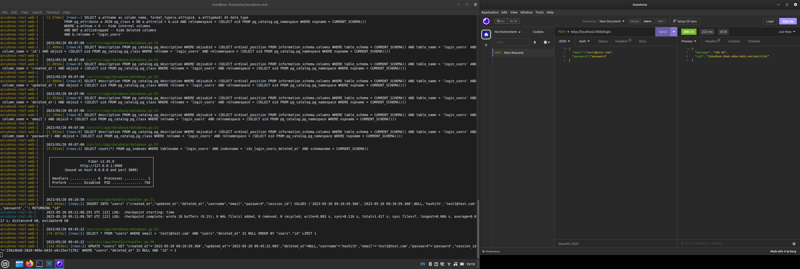
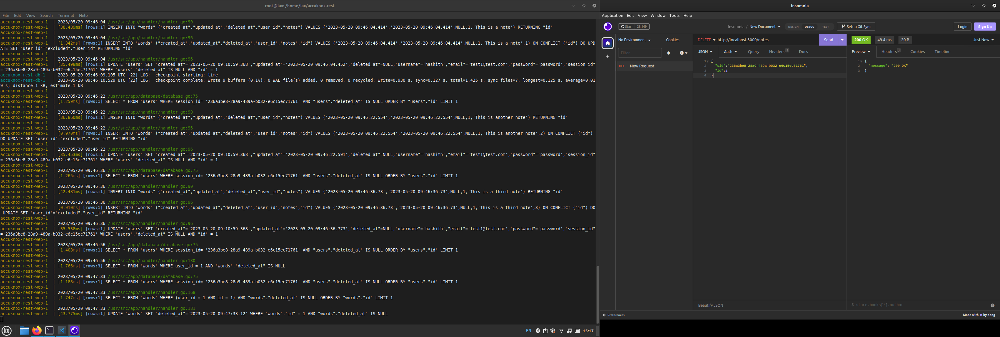

# Note Taking Application REST API (Go)

Note taking Application REST API is a Go-based project that provides a RESTful API for a note-taking application. It allows users to create, retrieve, update, and delete notes associated with their accounts.
Features

    User registration and authentication
    CRUD operations for notes
    Session-based authentication using session IDs
    PostgreSQL database integration
    Dockerized deployment using docker-compose

Prerequisites

Before running the application, make sure you have the following dependencies installed:

    Go (1.16 or higher)
    Docker
    Docker-compose

Important Libraries Used:

    Web Framework: Fiber (github.com/gofiber/fiber/v2)
    Database ORM : GORM
    SID generation: uuid

## Docker Image

    https://hub.docker.com/repository/docker/0xlax/accuknox-rest-api

## Getting Started

1) Follow these steps to get the project up and running on your local machine:

Clone the repository:

    git clone https://github.com/0xlax/accuknox-rest-api.git

Navigate to the project directory:

    cd accuknox-rest-api

Configure the environment variables:

    Add the required environment variables in the .env file. For example:

    DB_USER=your-db-username
    DB_PASSWORD=your-db-password
    DB_NAME=your-db-name

Build and run the application:

    docker-compose build

Remove Previous Containers and docker-compose up

    docker-compose down && docker volume rm accuknox-rest_postgres-db && docker-compose up

 Access the API:

    You can now access the API at http://localhost:3000

API Endpoints

The following endpoints are available:

    POST /signup: Register a new user.
    POST /login: Log in and obtain a session ID
    POST /notes: Create a new note for the authenticated user.
    GET /notes: Retrieve all notes for the authenticated user.
    DELETE /notes: Delete a specific note by ID for the authenticated user.

# Updating the Project

To update the project with the latest changes from Docker Hub, follow these steps:

Pull the updated image:

    docker pull 0xlax/accuknox-rest-api

Stop the running containers:

    docker-compose down

Start the containers again:

    docker-compose up 

This will recreate the containers using the updated image.

Incase of ERROR_SQLSTATE 22023, wipe and run docker again: 

    docker-compose down && docker volume rm accuknox-rest_postgres-db && docker-compose up

## Insomnia API Screenshots

### POST Request - Signup

### POST Request - Login

### POST Request - Create Note 1

#### POST Request - Create Note 2

#### POST Request - Create Note 3

### GET Request - List Notes

### DELETE Request - Delete Note

### GET Request (updated) 

# Challenges Faced

During the development of this project, I encountered the following challenges and successfully resolved them:

1) **Connecting PostgreSQL Container to another container**:
I needed to establish a connection between the PostgreSQL container and another container in my application stack.
I resolved this issue by defining the necessary network configuration in the docker-compose.yml file and linking the containers together.

2) **Environment Variables Clash**:
I encountered a situation where environment variables from different containers were clashing.
To resolve this issue, I reviewed and updated the environment variable names to ensure uniqueness and prevent clashes.

3) **Database Migrations**:
    Initially, I faced challenges with running database migrations when setting up the project.
    By using a migration tool like GORM's AutoMigrate function and ensuring proper configuration, I was able to overcome this challenge and successfully migrate the database schema.
